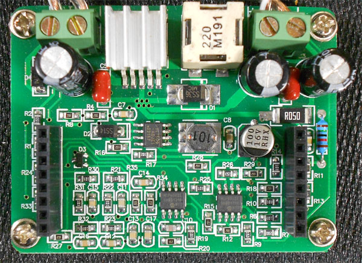
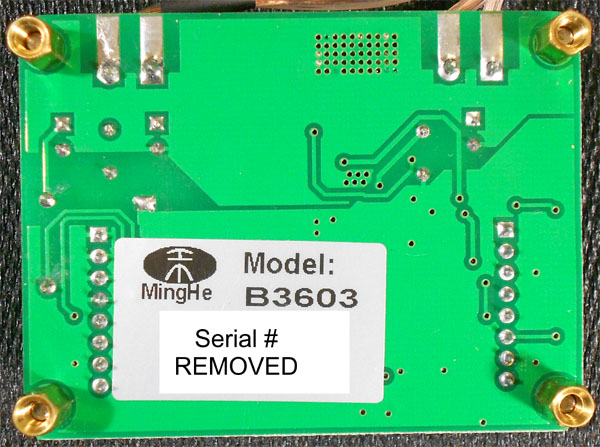
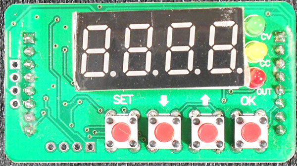
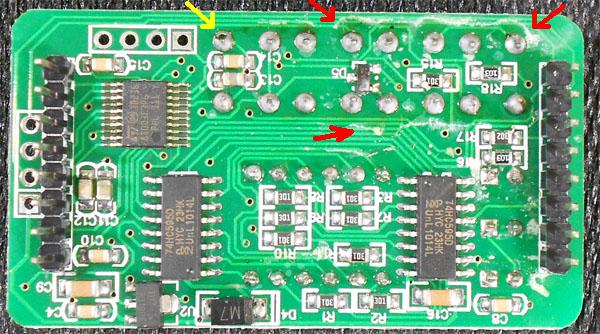
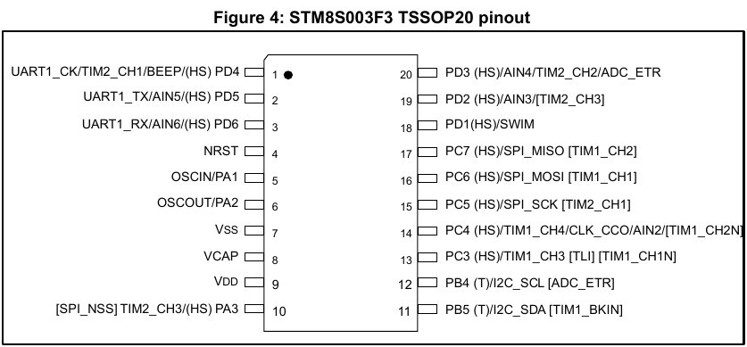
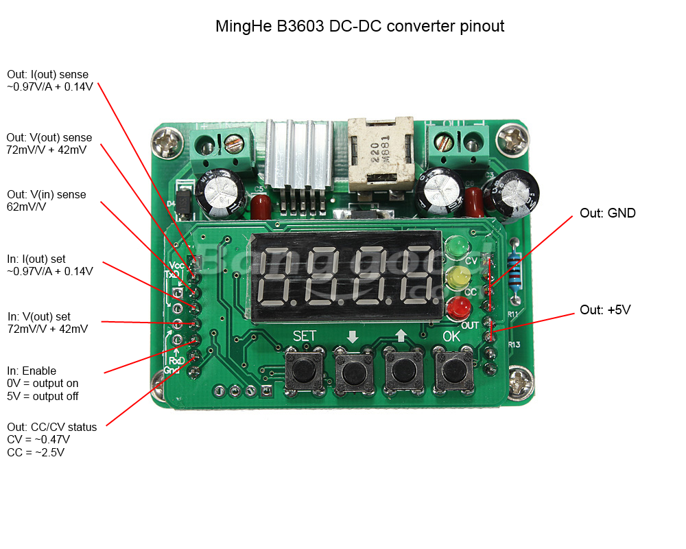
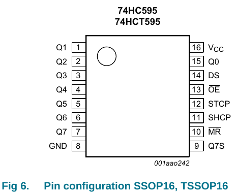

# B3603

## Regulator Board (bottom)

## Control Board (top)

### MCU

The MCU is an [STM8S003F3](http://www.st.com/web/catalog/mmc/FM141/SC1244/SS1010/LN2/PF251792). It is the TSSOP-20 package.

### Pinouts

Lets name the different pinout components, left and right are as seen looking at the top board with the 7-segment display up:

* MCU
* Left connector -- 8 pins left side
* Right connector -- 8 pins right side
* Serial connector -- 4 pins at left most side
* SWIM connector -- 4 pins at the bottom, just left of the buttons
* 74HC595 #1 -- The one closest to the MCU
* 74HC595 #2 -- The one furthest from the MCU

#### Pinout from MCU

* Pin 1: UART1\_CK/TIM2\_CH1/BEEP/(HS) PD4 -- 
* Pin 2: UART1\_TX -- Serial connector Pin 2 -- Right connector pin 8
* Pin 3: UART1\_RX -- Serial connector Pin 4 -- Right connector pin 7
* Pin 4: NRST -- ?
* Pin 5: OSCIN/PA1 -- ?
* Pin 6: OSCOUT/PA2 -- ?
* Pin 7: Vss (GND)
* Pin 8: Vcap
* Pin 9: Vdd
* Pin 10: SPI\_NSS / TIM2\_CH3 / PA3 (HS) -- ?
* Pin 11: PB5 (T) / I2C\_SDA / TIM1\_BKIN -- Left connector Pin 7 (CV/CC status)
* Pin 12: PB4 (T) / I2C\_SCL / ADC\_ETR -- Left connector Pin 6 (Enable)
* Pin 13: PC3 (HS) / TIM1\_CH3 [TLI] [TIM1_CH1N]-- Left Connector Pin 8 (?)
* Pin 14: PC4 (HS) / TIM1\_CH4 / CLK\_CCO / AIN2 / TIM1\_CH2N -- Left connector Pin 1 (Iout sense)
* Pin 15: PC5 (HS) / SPI\_SCK / TIM2\_CH1 -- Left connector Pin 4 (Iout set)
* Pin 16: PC6 (HS) / SPI\_MOSI / TIM1\_CH1 -- ?
* Pin 17: PC7 (HS) / SPI\_MISO / TIM1\_CH2 -- ?
* Pin 18: PD1 (HS) / SWIM -- ?
* Pin 19: PD2 (HS) / AIN3 / TIM2\_CH3 -- Left connector Pin 2 (Vout sense)
* Pin 20: PD3 (HS) / AIN4 / TIM2\_CH2 / ADC\_ETR -- Left connector Pin 3 (Vin sense)

#### Bottom Board Interface

The below was decoded by [bal00](http://www.reddit.com/r/arduino/comments/2so02f/can_anyone_recommend_a_cheap_cheerful_bench_power/cnrjdxo).

Right side:

* Top four (1-4) pins are GND
* Next two (5-6) are Vcc +5V (seems wrong)
* 7 is connected to MCU UART RX
* 8 is connected to MCU UART TX

Left side (Top to bottom):

* Pin 1: Iout sense, 970mV/A + 140mV
* Pin 2: Vout sense, 72mV/V + 42mV
* Pin 3: Vin sense, 62mV/V
* Pin 4: Iout control, 970mV/A + 140mV
* Pin 5: Vout control, 72mV/V + 42mV
* Pin 6: Enable control, 0V = output on, 5V = output off
* Pin 7: CC/CV sense, CV = 0.47V, CC = 2.5V
* Pin 8: Connected to MCU pin 13 (PC3)

#### Pinouts of 74HC595 chips

There are two 74HC595 TSSOP16, these control the 4 digit 7 segment display, and possibly the leds as well. The 7 segment display has 12 pins and is controlled constantly to create a persistence-of-vision effect.

